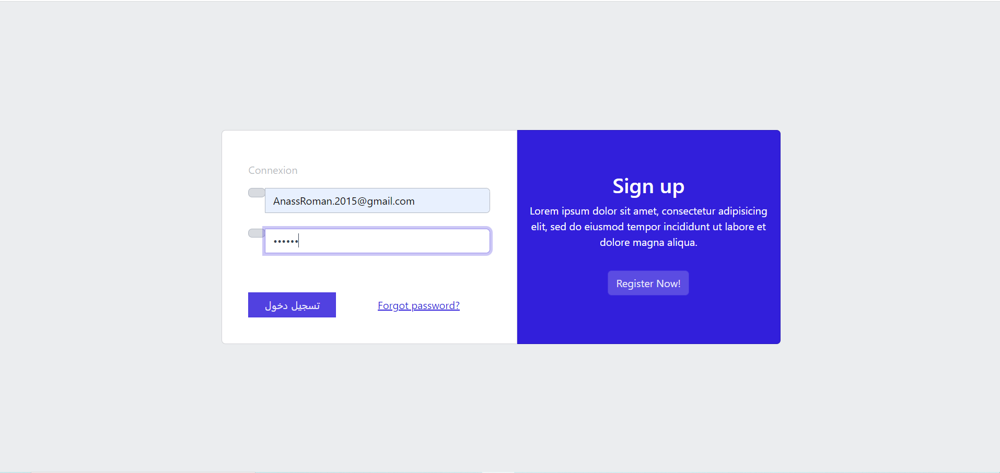
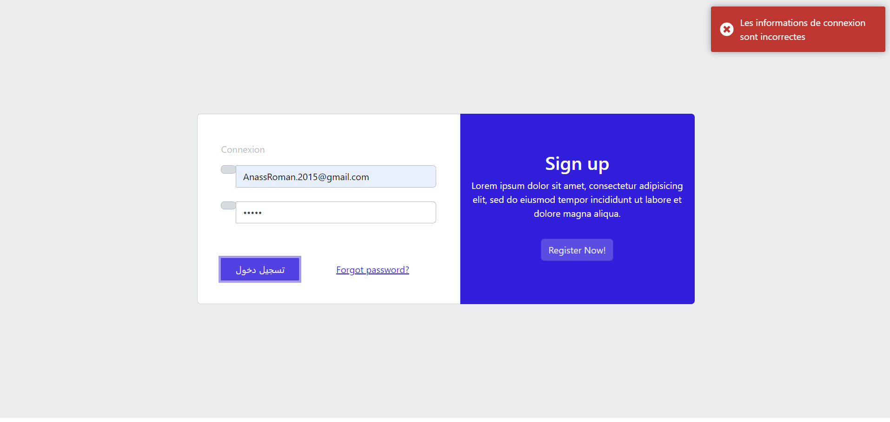
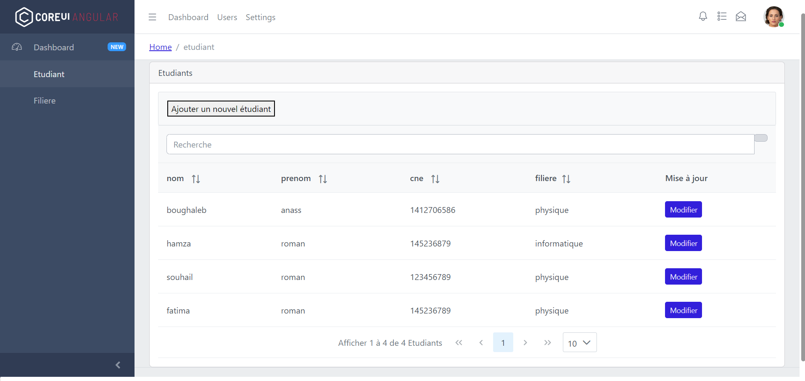
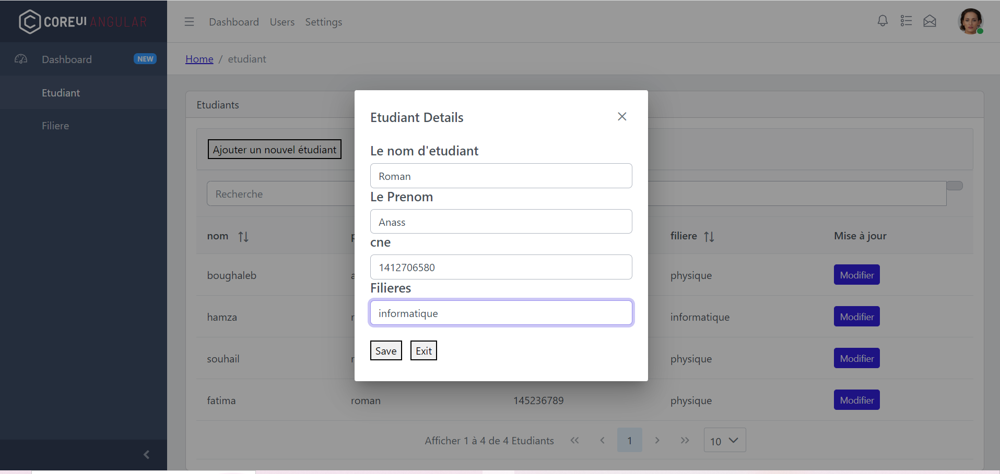
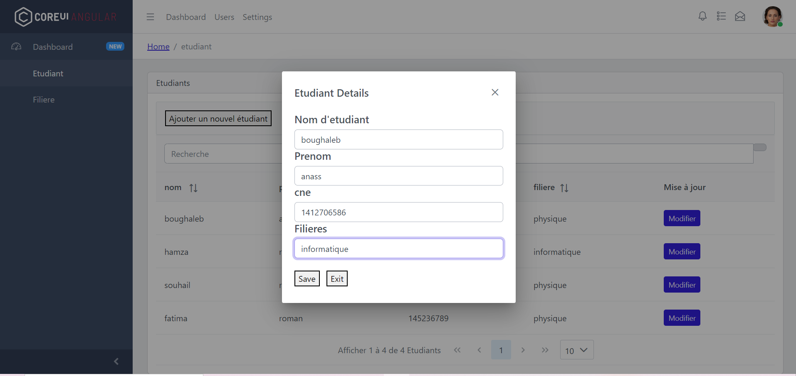
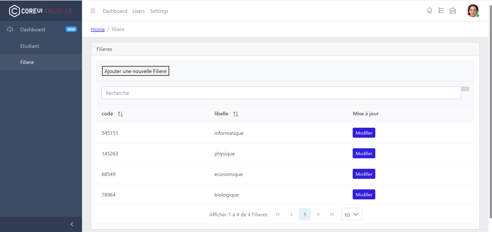
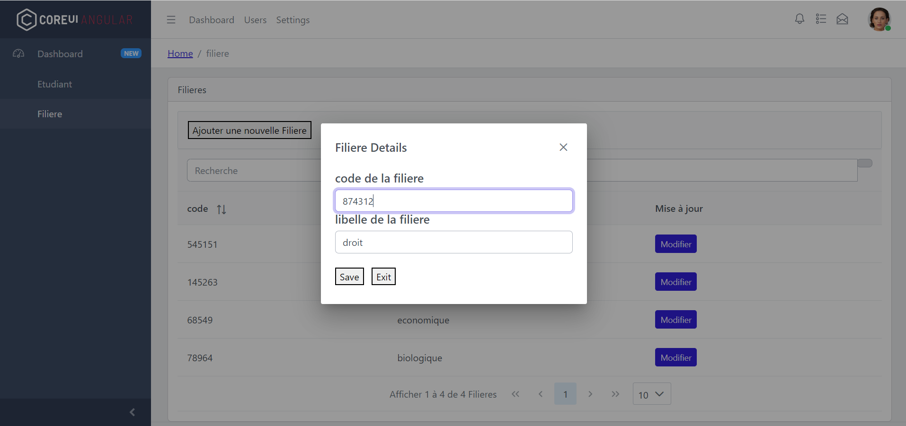
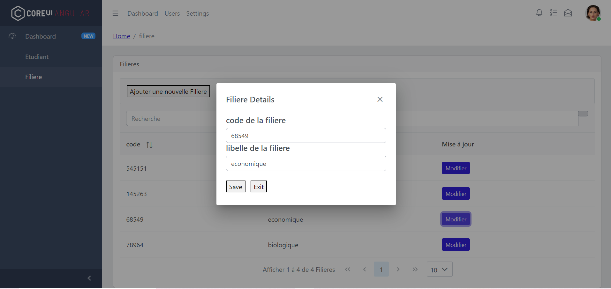

# Gestion des Étudiants et des Filières

## Intro/Objectif du projet
Ce projet est réalisé à l'aide du Mean Stack (MongoDB, ExpressJS, AngularJS, NodeJS). Ce projet permet de créer ou de supprimer ou de modifier une filière ou un étudiant.

#### -- Statut du projet : [Non Terminé]

## Comment Démarrer le projet

### Client

``` bash

# Allez dans le dossier Views
cd Views

# install dependencies
npm install

# demarrer le projet
ng serve 

```

### Serveur

``` bash

# Allez dans le dossier Api
cd Api

# install dependencies
npm install

# demarrer le projet
node server 

```

## Captures d'écran du projet
---

### Connexion :
---------------
<p align="center">


##### Si les informations de connexion sont incorrectes

</p>

***

### Gestion des Étudiants :
--------------------
<p align="center">


#### Pour Ajouter un Etudiant



#### Pour Modifier un Etudiant

</p>

***
### Gestion des Filieres :
--------------------
<p align="center">


#### Pour Ajouter une Filiere


#### Pour Modifier une Filiere

</p>


### Les technologies
* CoreUI Angular, [Télécharger](https://coreui.io/product/free-angular-admin-template/).
* Node JS 
* MongoDB
* ExpressJS
* JavaScript 
* TypeScript
* Bootstrap
* VSCode